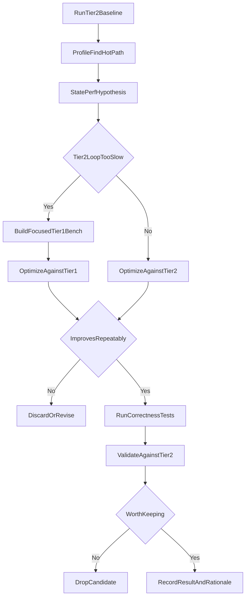

# Benchmarking Strategy

Master plan for Solid 2 performance work. The running journal of probes,
findings, and reverted experiments lives in
[`performance-experiments.md`](./performance-experiments.md).

## Goal

Build a fast AI-assisted performance workflow that starts narrow, uses
the existing external Solid benchmarks as the source of truth, and
promotes a hypothesis into an in-repo micro bench only when the AI
loop on the external suite gets too slow to iterate.

## Two-Tier Model

- **Tier 1 — in-repo micro benches.** Vitest `bench --run`. Fast (sub-5s),
  CI-runnable, AI-friendly. Cover signals graph work, stores, list
  reconciliation, JSX/runtime helpers, hydration-adjacent setup, and any
  hot path where headless Chromium round-trips are too slow to iterate.
- **Tier 2 — external Solid benchmarks.** [`js-framework-benchmark`][jfb]
  (DOM lane), [`js-reactivity-benchmark`][jsrb] (Node lane), UIBench /
  Sierpinski-style demos. Authoritative for absolute numbers and
  cross-framework comparison. Slower loop, used as validation.

[jfb]: https://github.com/krausest/js-framework-benchmark
[jsrb]: https://github.com/milomg/js-reactivity-benchmark

## Workflow

The loop is **Tier 2 first**: external suites pick the targets,
profiling tells us what the hot path is, and a Tier 1 bench is
built only when the iteration loop on Tier 2 is too slow to pursue
the optimization (or a specific allocation/shape question needs
focused measurement). Tier 1 is the iteration tool. Tier 2 is the
source of truth.

1. **Establish a Tier-2 baseline before optimizing.** Pick a Tier-2
   lane (`js-framework-benchmark`, `js-reactivity-benchmark`,
   UIBench, SSR shootout, etc.). Run it several times on the same
   machine. Capture median, spread, Node/browser version, command,
   commit SHA, any flags. Single-run improvements are noise until
   repeated.
2. **Identify the hot path before committing to a Tier-1 bench.**
   CPU profile / size / allocation profile against the Tier-2 run.
   Decide what's actually slow and form a hypothesis. Don't build a
   Tier-1 bench just because a lane exists — build it only when
   - the Tier-2 iteration loop is too slow for AI-assisted probing, or
   - the hypothesis is about a specific shape / allocation / hidden
     class that Tier 2 can't isolate.
3. **Optimize against the hypothesis.**
   - One change at a time.
   - Run the focused bench (Tier 1 if it now exists, Tier 2 directly
     otherwise).
   - Compare before/after locally.
   - Run correctness tests (`pnpm test`). Required for any change
     touching async boundaries, transitions, tracking, or rendering.
   - Tier-1 wins must be validated against the relevant Tier-2 suite
     before they stay (with the hydration carve-out — see Guardrails).
4. **Record the result in `performance-experiments.md`.** Each
   attempt ends with: benchmark target + command, before/after
   numbers, σ band, correctness status, Tier-2 validation result,
   and why the change should or should not stay.

## Current State

### Tier 1 today

Reactivity lane — `pnpm --filter @solidjs/signals bench`:

- `packages/solid-signals/tests/core/reactivity.bench.ts` — graph
  creation/update microbenches.
- `packages/solid-signals/tests/store/utilities.bench.ts` — store helpers.
- `packages/solid-signals/tests/store/listened-paths.bench.ts` —
  Solid 2.0's unique listened-paths store optimization
  (`applyState` walks `Object.keys(nodes)` instead of the full tree
  unless `$TRACK` is subscribed). Three subscription shapes against
  a deeply-nested tree (~12k leaves, 4–6 levels):
  - `sparse` — 10 deep-leaf effects. Optimized path active.
  - `per-leaf` — every leaf has its own effect. Optimized path active
    but with a denser `nodes` tree at every level.
  - `deep()` — single effect using the `deep()` helper, which forces
    `$TRACK` subscription on every node. Optimization bypassed; full
    tree walked. Real production idiom (sync engines, worker bridges).
  The `deep()` vs `sparse`/`per-leaf` ratio is the visibility of the
  listened-paths optimization; if anyone regresses `applyState` to
  always walk the full tree, that ratio collapses.
- `packages/solid-signals/tests/store/reconcile-tree.bench.ts` — the
  UIBench lane. UIBench drives Solid entirely through `store` +
  `reconcile()`: each frame hands the framework a fresh *immutable*
  state tree that Solid reconciles into a `createStore`, so UIBench's
  hot path for Solid is `store/reconcile.ts` (keyed map/LIS reorder,
  node reuse, `applyState` walk) — **not** `mapArray`/`dom-expressions`
  (that is the JFB/DOM lane; see `reconcile-permute.bench.tsx`). This
  bench mirrors UIBench's `tree` scenario: a nested tree of keyed
  `{ id, children }` nodes (root + 10 + 100 + 1000 = 1111) reconciled
  per iteration, with `reverse` and Fisher–Yates `shuffle` permutations
  that preserve ids so `reconcile` takes the recursive move-detection
  path at every level rather than replacing nodes. A recursive tracking
  effect subscribes to every node id and children index (what a
  recursive `<For>` does) so the reorder actually reuses nodes and
  re-runs consumers. It is the store-lane analog to the DOM-lane
  `reconcile-permute.bench.tsx`; the two exercise different code
  (`store/reconcile.ts` vs `dom-expressions/reconcile.js`).

Used during the 2026-04 → 2026-05 session for the missing-key store
fast path, scheduler micro paths, and listened-paths regression gating.
Working as intended for the signals lane.

DOM lane — `pnpm --filter @solidjs/web bench`:

- `packages/solid-web/test/mount-clear-cycle.bench.tsx` — 1k-row `<For>`
  mounted then cleared every iteration. Vitest's reported mean is the
  full cycle (mount + clear); the bench also `performance.now()`-times
  each half and logs avg-mount and avg-clear in `afterAll` so JFB
  `01_run1k`/`07_create10k` and `09_clear1k_x8` can be tracked
  separately from a single bench. Doubles as a memory-leak gate via
  `assertOwnerCount(baseline === final)` after all iterations.
- `packages/solid-web/test/replace-full.bench.tsx` — 1k rows, replaced
  with fresh-id rows on every iteration. Mirrors JFB `02_replace1k`.
  Also a memory-leak gate against reconcile-time owner retention (the
  exact failure mode `47c0e6fa` fixed).
- `packages/solid-web/test/update-partial.bench.tsx` — 1k rows mounted
  once, then every 10th row's label signal updated × 16 per iteration.
  Mirrors JFB `03_update10th1k_x16`. Pure render-effect commit cost.
  Also asserts no owner-tree drift on the update path.
- `packages/solid-web/test/reconcile-permute.bench.tsx` — 1k rows
  reordered every iteration. Two sub-benches:
  - `reverse` — full list reverse. Drives the symmetric end-swap branch
    in `dom-expressions/reconcile.js` that the `2fe6310f` surgical fix
    targets. Hottest signal for that path; collapses if anyone reverts
    the dual-anchor pattern.
  - `shuffle` — deterministic Fisher–Yates. Lands in the map/LIS
    reorder fallback. General move-detection coverage that JFB's
    `02_replace1k` doesn't exercise.
  Both also act as leak gates against owner retention through reorder.

All run under ~5s total in jsdom + vitest bench. RME is ≤5% on
the cycle benches and well under 1% on the update bench, which is
already enough to detect the deltas this session's optimizations
moved on Tier 2 (`02_replace1k` ±0.5ms, `03_update10th1k_x16`
±0.3ms — both inside our σ band).

SSR lane — `pnpm --filter @solidjs/web bench:server`:

- `packages/solid-web/test/server/color-picker.bench.tsx` —
  structurally mirrors Tier-2 `isomorphic-ui-benchmarks/color-picker`
  solid-next entry: a small nested tree with a per-row component
  rendered under `<For>`, plus a single conditional class expression
  and an outer signal-derived text accessor. Captures: mapArray
  row-owner pool churn, deferred-closure walk in `tryResolveString`,
  `ssr()` arg-walk on attribute-heavy templates, per-row `_$memo()`
  ternary wrap.
- `packages/solid-web/test/server/search-results.bench.tsx` —
  structurally mirrors Tier-2
  `isomorphic-ui-benchmarks/search-results` solid-next entry: a flat
  list of 50 `<Item>` components, each with multiple dynamic JSX
  expressions and a `_$memo()`-wrapped conditional ternary. This is
  the bench where the residual gap to Solid 1.x lives — Solid 1.x
  emits a single `ssr()` per component with eagerly-computed args
  (no per-expression closures, no per-item conditional memo). The
  Tier-1 bench exists so closure-elision / memo-elision experiments
  can be probed against a fast-feedback loop instead of bouncing to
  the external repo.

Both run under node + SSR-mode JSX compile via
`vite.config.server-bench.mjs`. RME is ≤5% on `color-picker` and ≤4%
on `search-results` across two consecutive runs (`color-picker` ~85k
hz, `search-results` ~14.6k hz on the reference machine).
Tier-1 absolutes are higher than Tier-2 (no Benchmark.js framework
overhead, unbundled source) — what matters is the *delta* between
baseline and probe within the same bench. Tier 2
(`isomorphic-ui-benchmarks`) remains the source of truth for
absolute numbers and cross-framework comparison.

Default `pnpm bench` (DOM lane, jsdom env) excludes the SSR benches
via `benchmark.exclude` — `vitest bench` reads that key separately
from `test.exclude`, otherwise the SSR benches would be picked up
under the wrong build aliases.

Notes on what these benches do **not** capture and why that is fine
for Tier 1:

- jsdom is slower than real DOM, so absolute numbers won't match JFB
  (e.g., `02_replace1k` is `~25ms` here vs `~9ms` script in JFB). What
  matters is *deltas* between baseline and probe within the same
  bench. Tier 2 remains the source of truth for absolute numbers.
- These benches run dev-mode source (matches the signals bench), so
  diagnostics overhead is included. Production bundles can move
  differently; Tier 2 is the validator.
- No paint/layout timing. jsdom can't measure it; not a Tier-1 goal.

### Tier 2 today

- `js-framework-benchmark` (`keyed/solid-next`, `keyed/solid` for
  Solid 1.x baseline). The 9-bench CPU suite is the primary DOM-lane
  reference. Run as 10+ rep medians; record stddev for σ bands.
- `js-reactivity-benchmark` for Node-side reactivity regressions.
- DBMon / Sierpinski / per-app demos for paint/layout-sensitive
  scenarios — used ad hoc.

### Roadmap (Tier 2 first, Tier 1 on demand)

Three lanes still to cover, in order. For each one the order is:
*run Tier 2 → profile → decide if a Tier-1 bench earns its keep →
build it only if the Tier-2 loop is too slow or the hypothesis
needs isolation.* The Tier-1 candidates listed below are sketches,
not commitments — promote them only if the Tier-2 work demands it.

1. **Diff / reconcile.** **Tier-2 anchor:** UIBench (existing).
   Run UIBench against `solid-next` to baseline diff/reconcile cost
   and identify the hot operations. Note UIBench drives Solid through
   `store` + `reconcile()` (fresh immutable tree reconciled per frame),
   so its hot path is `store/reconcile.ts`, not `mapArray`/
   `dom-expressions`. *Tier-1 covered:*
   `store/reconcile-tree.bench.ts` (store lane) is the UIBench analog —
   a keyed nested `{ id, children }` tree reconciled per frame with
   `reverse`/`shuffle` permutations, exercising `store/reconcile.ts`'s
   recursive move-detection (map/LIS) path. `reconcile-permute.bench.tsx`
   (DOM lane) is the JFB-style analog and covers the *separate*
   `dom-expressions/reconcile.js` array-permute path (`<For>` over a
   signal → `mapArray`) with `reverse` and Fisher–Yates `shuffle` modes;
   it does **not** touch `store/reconcile.ts`. `listened-paths.bench.ts`
   (store lane) covers the `applyState` listened-paths walk with
   sparse / per-leaf / `deep()` subscription shapes — the one thing JFB
   and UIBench *can't* cover, because both subscribe to every field per
   row by construction. Promoted into Tier 1 because the UIBench loop
   was too slow to bisect and the store-reconcile reorder path had no
   focused coverage.
2. **SSR.** **Tier-2 anchor:** `isomorphic-ui-benchmarks` (Patrick
   Steele-Idem's repo, sibling checkout at
   `../isomorphic-ui-benchmarks`). Two suites — `color-picker` and
   `search-results` — driving `renderToString` via Benchmark.js with
   100-cycle warmup and `--expose-gc`. The repo runs Solid 1.x and
   `solid-next` (2.0) side-by-side via parallel `solid/` and
   `solid-next/` entries with `file:` workspace dependencies for
   `@solidjs/web` / `babel-preset-solid`, so every SSR run gives us
   the 1.x→2.0 delta on `renderToString` plus React/Inferno
   competitors.

   *Tier-1 promoted:* `packages/solid-web/test/server/*.bench.tsx`
   covers both shapes (`color-picker.bench.tsx`,
   `search-results.bench.tsx`) under node + SSR-mode JSX compile
   via `vite.config.server-bench.mjs`. Run with
   `pnpm --filter @solidjs/web bench:server`. Promoted in the
   2026-05-08 session because the Tier-2 iteration loop on
   `search-results` (rebuild bundle → run benchmark.js → wait for
   warmup + 100 cycles ≈ 25–30s per probe) was too slow for the
   AI-assisted closure/memo elision experiments the post-Inv-15
   profiles surfaced.
3. **Isomorphic / hydration.** Depends on (2)'s SSR work being far
   enough along to capture stable HTML.

   **Tier-2 gap:** there is no widely-accepted cross-framework
   hydration benchmark to anchor against today. So this lane
   inverts the doctrine: there is no Tier-2 baseline to start from,
   only a Tier-1 bench (SSR → captured HTML → boot jsdom →
   `hydrate()`) that measures *Solid-internal deltas* — probe vs
   baseline on the same machine, same Solid version. It is **not**
   evidence that hydration is fast in absolute terms. The "Tier-1
   win that vanishes on Tier 2 is not a win" guardrail is
   explicitly carved out for this lane (see Guardrails).

   If the hydration lane becomes a perf focus, the right answer is
   to build our own Tier-2 anchor first — a small fixed Solid app
   hydrated in real Chromium via Playwright / CDP, mirroring how we
   run JFB — and rerun the loop in the standard order. That uplift
   is intentionally deferred until perf focus actually lands here,
   so we don't ship the museum before we need it.

### Tier 1 follow-ups

- **Smoke test for the leak gate.** The owner-count assertions in the
  three DOM benches will throw when the tree drifts beyond a small
  scaffolding allowance. They have not been verified by reverting
  `47c0e6fa`'s fix and confirming the throw fires. Adding a regular
  `*.spec.tsx` that intentionally leaks one owner and asserts the
  detection path triggers would close that loop.
- **Root convenience script.** `pnpm bench` at the repo root that
  fans out to both per-package bench scripts. Plan deferred this
  until the per-package commands settled — they have now.
- **Native per-iteration setup hook.** Vitest 2.x's `bench()` does not
  forward tinybench's `FnOptions.beforeEach` (only `Bench.Options`),
  so isolated mount-only or clear-only benches need a side-channel
  (`performance.now()` inside the cycle, log in `afterAll`) — the
  pattern `mount-clear-cycle.bench.tsx` already uses. If vitest exposes
  per-iteration hooks in a future major, replace the side channel
  with two clean benches.

What we are explicitly *not* adding:

- A reproduction of full JFB. Tier 2 already exists; reproducing it
  locally is the museum-building anti-pattern.
- Browser-side benches in this repo. Build/launch cost destroys the
  feedback loop, which is the whole point of Tier 1.
- Paint/layout timing in Tier 1. jsdom can't measure it; Tier 2 already
  does. Not needed for the AI loop.

## Doctrine

### Structural floors vs open targets

Some gaps are not optimization targets. From the 2026-05 investigation:

- `03_update10th1k_x16` — the residual gap to Solid 1 / R3 is a
  structural cost of the 2.0 render-effect model (split compute/effect
  with async-safe non-mutating payloads). Closing it requires changing
  the model; the model is load-bearing for transitions/async/deep
  correctness. Treat as a fixed floor unless a re-design is on the
  table. See [`performance-experiments.md` §
  `03_update10th1k_x16` Conclusion: Structural Cost of Render-Effect
  Model](./performance-experiments.md).
- `02_replace1k` — the ~`160 µs/iter` cost of the store proxy's lazy
  missing-key tracking on `selected[rowId]` is a benchmark-author
  choice in JFB's Solid 2 source, not a runtime regression. Remaining
  ~`5.5 ms/iter` is inherent DOM cost (`remove`, `cloneNode`,
  `insertBefore`), identical between Solid 1 and Solid 2. Not an
  optimization target on the runtime side.

### Open optimization targets (as of 2026-05)

- Creation-side wins on `01_run1k` / `07_create10k` /
  `08_create1k-after1k_x2` — lazy node-field allocation, mapArray row
  scaffolding, initial-run shortcut for fresh effects. Tracked in
  `performance-experiments.md`.

## Guardrails

- **Don't benchmark everything upfront.** The early goal is a
  trustworthy loop, not a benchmark museum.
- **Don't optimize to a synthetic bench unless the win also maps to
  Tier 2 or a known user-facing pattern.** A Tier-1 win that vanishes
  on Tier 2 is not a win. *Exception:* the hydration lane has no
  Tier-2 anchor today and runs Tier-1-only by necessity (see Tier 1
  roadmap → Isomorphic / hydration). For that lane, "useful for
  Solid-internal deltas" replaces "validated against Tier 2".
- **Pair correctness tests with perf changes.** Any change to async
  boundaries, transitions, tracking, or rendering needs focused
  behavioral coverage before it's trusted. `pnpm test` must pass.
- **Document changesets per package.** Source change under
  `packages/<pkg>/src/` ⇒ a changeset entry naming that package. See
  [`.cursor/rules/engineering-standards.mdc`](../.cursor/rules/engineering-standards.mdc).
- **One change at a time.** Multi-change probes can't be attributed.
- **σ-band, not point estimates.** Single-run "improvements" that fall
  inside the σ band of the baseline are not improvements.

## Cross-references

- Running journal of probes, findings, and reverts:
  [`performance-experiments.md`](./performance-experiments.md).
- Engineering standards (changesets, communication, correctness-first
  approach): [`.cursor/rules/engineering-standards.mdc`](../.cursor/rules/engineering-standards.mdc).
- Async-registration invariants for transitions:
  [`.cursor/rules/async-registration-invariants.mdc`](../.cursor/rules/async-registration-invariants.mdc).
